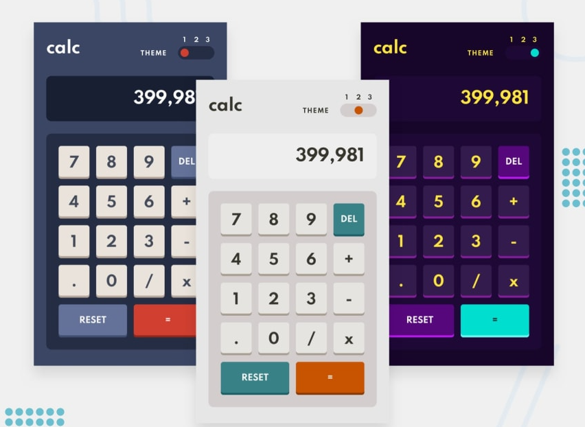

# Frontend Mentor: Calulator App Challenge
 
## Welcome 🍃

This calculator App was a cool project to put into practice my `CSS` and `Vanilla Javascript` skills.

## Links
- My Linkedin [Linkedin](https://www.linkedin.com/in/mouhametndiaye/)
- My email ahmetndiaye404@gmail.com
- Live Project [Calculator App](https://mouhametnd-calculator.netlify.app/)
- Challenged by [Frontend Mentor](https://www.frontendmentor)

## Challenge  

Your users should be able to:

- See the size of the elements adjust based on their device's screen size
- Perform mathematical operations like addition, subtraction, multiplication, and division
- Adjust the color theme based on their preference
- Redraw the calculator with the chosen theme when the page is refresh

## App Design

## Built with

- Mobile-first workflow
- Semantic HTML5 markup
- SASS
- Vanilla JavaScript And localStorage

## What I learned
- JavaScript modules
- Changing CSS custom properties with JS
- Set and Get to localStorage
